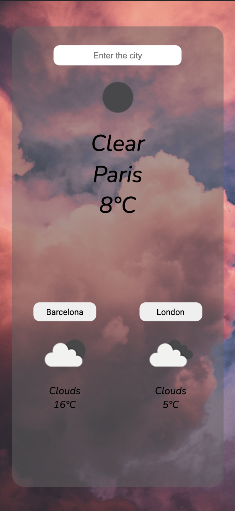

# Weather_app

Simple app which shows my favorite cities -> Barcelona and London. As well there's an option to search any city in the world, to get the weather.

## Screenshots

<p align="center">

</p>

## Getting Started

1. Clone repo

```
git clone -> https://github.com/Jonas-Petrauskas/Weather_app.git
```

2. Install Dependencies in the **Client**

```
Client -> npm install
```

3. Start **Client**

```
Client -> npm start
```

## Developer

Jonas Petrauskas - [GitHub](https://github.com/Jonas-Petrauskas) - [LinkedIn](https://www.linkedin.com/in/jonas-petrauskas-78038894/)
